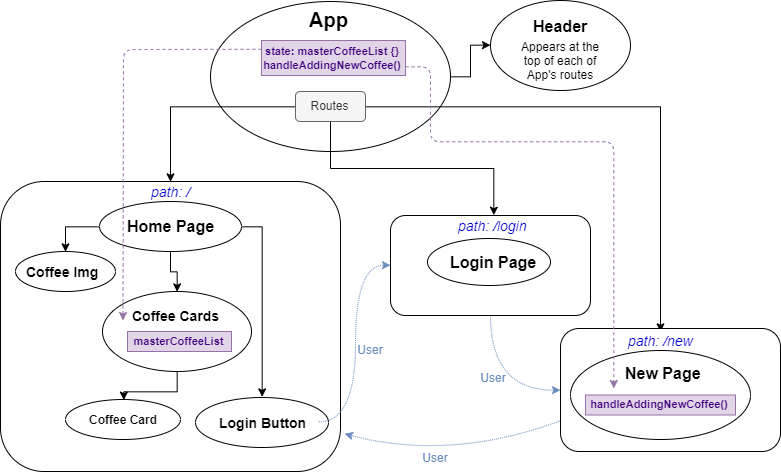

# _Java House_

#### _A site for a fictional coffee supplier created with React, 23 Nov 2019_

#### By _**Jacqueline Remmel**_

## Description

_This project is a mock site for a coffee supplier. The home page displays the coffee house's menu and employees can manage the inventory. The main purpose of this project is to practice building a site with React and managing state._

_Component Structure:_

 

## Setup/Installation Requirements

* _Clone this repository_
* _Navigate to the project directory, "react-independent-project"_
* _Run the command "npm install"_
* _Run the command "dotnet watch run"_

## Technologies Used

_JavaScript, React, React Router, Materialize CSS, HTML, Webpack, ESLint, Babel_

### License

*Open-source*

Copyright (c) 2019 **_Jacqueline Remmel_**