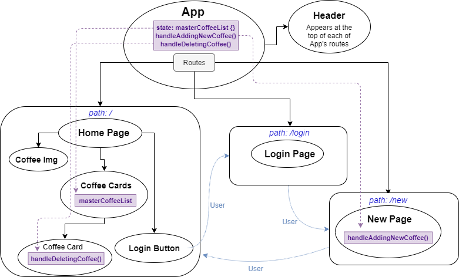

# _Java House_

#### _A site for a fictional coffee supplier created with React, 22 Nov 2019_

#### By _**Jacqueline Remmel**_

## Description

_This is an ongoing project that will ultimately be a mock site for a coffee supplier. Patrons will be able to view the coffee house's menu and employees will be able to log in to manage the inventory. The main purpose of this project is to practice building a site with React._

_Component Structure:_

 

## Setup/Installation Requirements

* _Clone this repository_
* _Navigate to the project directory, "react-independent-project"_
* _Run the command "npm install"_
* _Run the command "dotnet watch run"_

## Technologies Used

_JavaScript, React, React Router, Materialize CSS, HTML, Webpack, ESLint, Babel_

### License

*Open-source*

Copyright (c) 2019 **_Jacqueline Remmel_**